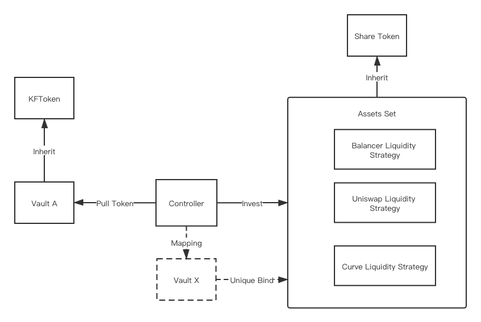

# Design

# Build
## Init Environment
```
npm init -y
npm install web3
npm install ethereumjs-testrpc
npm install solc
npm install truffle
npm install truffle-flattener
npm install --save-dev eth-gas-reporter
truffle init
```

## Dependent Module
```
npm install @openzeppelin/contracts
npm install @openzeppelin/test-helpers
npm install @uniswap/v2-core
npm install @uniswap/v2-periphery
```
# Fund List
Uni liquidity strategy: UniDynamicLiquidityStrategy.sol
